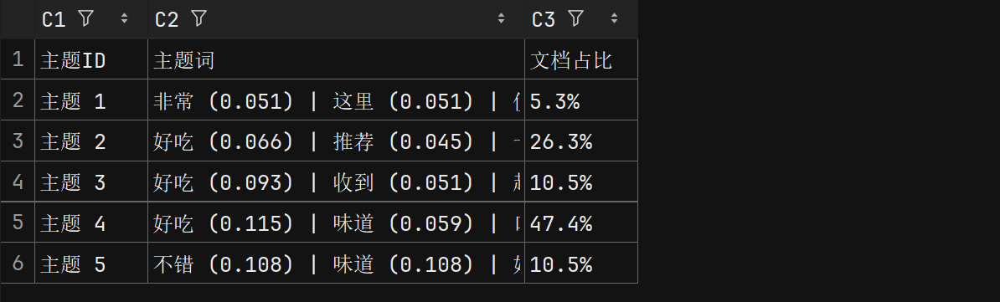
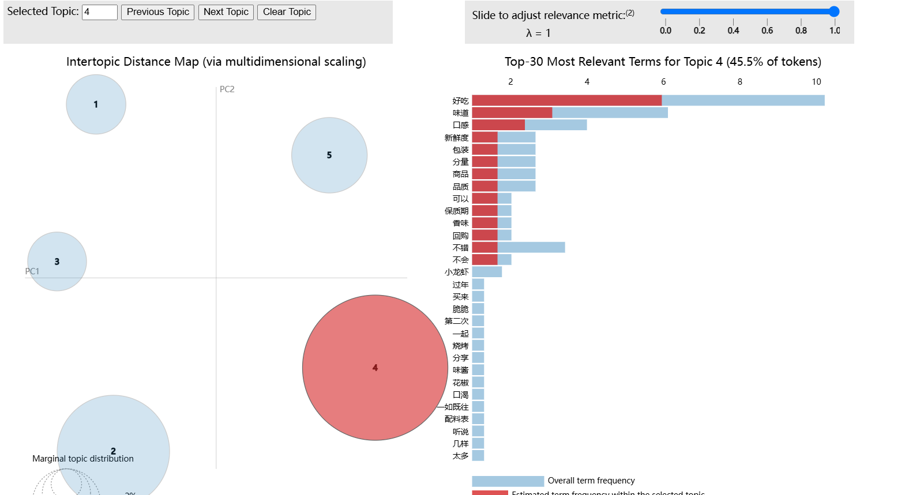

# 淘宝评论文本挖掘系统

一个基于 Python 的淘宝商品评论爬取和分析系统，支持评论爬取、文本分析、主题建模和可视化。





## 功能特点

- 自动爬取淘宝商品评论
- 文本分词和词频统计
- LDA 主题模型分析
- 词云图生成
- 主题分布可视化
- 结果数据导出

## 环境要求

- Python 3.10+
- Chrome 浏览器
- Docker（可选）

## 快速开始

### 使用 Docker（推荐）

1. 构建镜像：

   ```bash
   docker-compose build
   ```
2. 运行容器：

   ```bash
   docker-compose up
   ```


### 本地安装

1. 克隆项目：
   ```bash
   git clone <repository-url>
   cd LDAanalysis
   ```


2. 创建虚拟环境：
   ```bash
   python -m venv
   source venv/bin/activate # Linux/Mac

   .\venv\Scripts\activate # Windows
   ```


3. 安装依赖：
   ```bash
   pip install -r requirements.txt
   ```


4. 运行程序：
   ```bash
   python main.py
   ```


## 使用说明

1. 启动程序后，会自动打开浏览器等待登录
2. 手动完成淘宝登录（15秒内）
3. 输入商品链接开始爬取评论
4. 程序会自动进行以下处理：
   - 爬取评论数据
   - 进行文本分析
   - 生成词云图
   - 进行主题分析
   - 保存分析结果

## 项目结构

```
TextMining/
├── crawler/ # 爬虫模块
├── analysis/ # 文本分析模块
├── visualization/ # 可视化模块
├── utils/ # 工具模块
├── output/ # 输出目录
│ ├── data/ # 数据文件
│ ├── visualization/ # 可视化文件
│ └── logs/ # 日志文件
├── config.json # 配置文件
├── requirements.txt # 依赖清单
├── Dockerfile # Docker配置
└── docker-compose.yml # Docker Compose配置
```


## 配置说明

系统的主要配置项在 `config.json` 中：

- `CRAWLER`: 爬虫相关配置

  - `MAX_PAGES`: 最大爬取页数
  - `WAIT_TIME`: 等待时间设置
  - `LOGIN_TIMEOUT`: 登录等待时间
- `ANALYSIS`: 分析相关配置

  - `TOPIC_COUNT`: 主题数量
  - `WORDS_PER_TOPIC`: 每个主题的关键词数量
- `VISUALIZATION`: 可视化相关配置

  - `WORDCLOUD`: 词云图设置
  - `TOPIC_PLOT`: 主题分布图设置

## 输出文件

- `comments.txt`: 原始评论数据
- `word_frequencies.csv`: 词频统计
- `topic_analysis.csv`: 主题分析结果
- `wordcloud.png`: 词云图
- `topic_distribution.png`: 主题分布图
- `lda_visualization.html`: 交互式LDA可视化

## 注意事项

1. 首次运行需要手动登录淘宝
2. 爬取速度受网络条件影响
3. 建议适当调整等待时间避免被反爬
4. 确保系统安装了所需的中文字体

## 常见问题

1. **登录超时**

   - 可以在配置文件中增加 `LOGIN_TIMEOUT` 的值
2. **未找到评论**

   - 检查商品链接是否正确
   - 确认商品是否有评论
   - 尝试增加等待时间
3. **字体问题**

   - 安装所需的中文字体：`sudo apt-get install fonts-noto-cjk`
   - Windows 系统字体问题，请查看issue
4. **SSL证书问题**

   - pip install --upgrade requests urllib3 pyOpenSSL 更新依赖
   - 关闭网络代理，或者仅使用系统代理
   - 修改源代码，指定网站所需的 TLS 版本

## License

MIT License

## 贡献指南

欢迎提交 Issue 和 Pull Request
